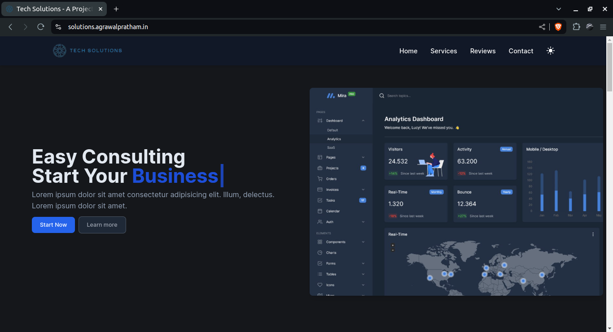

# Tech Solutions

## Overview

Tech Solutions is a modern, responsive landing page built with Next.js and Tailwind CSS. It serves as a professional portfolio and a landing page for service-based companies offering full web development services. This project showcases various interactive web elements and advanced web development techniques.

## Features

- Next.js for server-side rendering and fast performance.
- Tailwind CSS for utility-first CSS styling.
- React-Awesome-Reveal for beautiful animations and reveals.
- react-icons for easy integration of popular icons.
- react-count-up for animated counting numbers.
- react-syntax-highlighter for displaying code snippets.
- react-typed for typing animations.
- SEO optimized with appropriate meta tags, Open Graph tags, Twitter cards, and structured data.

## Live Demo

Check out the live demo [here](https://solutions.agrawalpratham.in/).

## Screenshots



## Getting Started

### Prerequisites

- Node.js
- npm or yarn

### Installation

## Run Locally

Clone the project

```bash
  git clone https://github.com/agrawal-pratham/Tech-Solutions.git
```

Go to the project directory

```bash
  cd Tech-Solutions
```

Install dependencies

```bash
  npm install
```

Start the server

```bash
  npm run dev
```

Project Structure

```bash
├── components    # Reusable components
├── pages         # Next.js pages
├── public        # Static assets
├── styles        # Global styles and Tailwind CSS configurations
├── utils         # Utility functions
└── README.md     # Project documentation
```

## Libraries and Technologies Used

- [Next.js](https://nextjs.org/)
- [Tailwind CSS](https://tailwindcss.com/)
- [React Awesome Reveal](https://react-awesome-reveal.morello.dev/)
- [react-icons](https://react-icons.github.io/react-icons/)
- [react-count-up](https://github.com/glennreyes/react-countup)
- [react-syntax-highlighter](https://github.com/react-syntax-highlighter/react-syntax-highlighter)
- [react-typed](https://github.com/ssbeefeater/react-typed)

## Contributing

Contributions are welcome! Please open an issue or submit a pull request for any bugs, enhancements, or features.

## License

This project is licensed under the MIT License. See the LICENSE file for details.

## Contact

Created by [Pratham Agrawal](https://agrawalpratham.in/). Feel free to reach out!
